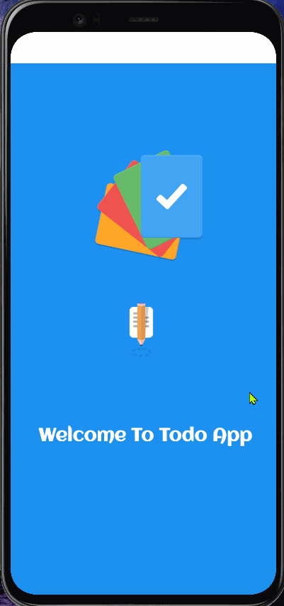

# TodoApp_by_Aashu

<h1>Features of TodoApp</h1>
<ul>
    <li>Add your own todo tasks with title, description, completion status and date.</li>
    <li>Edit the todo list.</li>
    <li>Display the todo specific to the user in the home page.</li>
    <li>Delete individual todo by swiping.</li>
    <li>Delete all the todo tasks that are completed.</li>
    <li>Delete all the todo tasks at once.</li>

</ul>

<h1>Additional features</h1>
<ul>
    <li>User can login by using the id.</li>
    <li>logout function.</li>
</ul>

